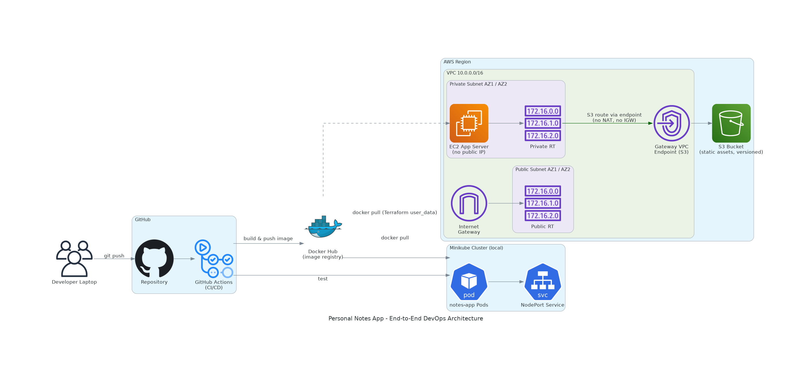

# 📝 Personal Notes App — End-to-End DevOps Deployment Pipeline


A full-stack Notes/Journal application, containerized and deployed using a
production-style DevOps pipeline: Docker → Docker Hub → Terraform-provisioned
AWS infrastructure → Kubernetes, with S3 versioned static assets accessed via
a Gateway VPC Endpoint (no NAT Gateway required).

---

## 📖 Project Overview

Users can create, view, edit, and delete personal notes through a clean web
UI backed by a Flask REST API and a MySQL database. The same Docker image is
deployed two ways to demonstrate different orchestration models:

1. **AWS** — a private EC2 instance provisioned entirely with Terraform.
2. **Kubernetes (Minikube)** — a Deployment + Service for local orchestration
   practice.

## 🏗️ Architecture



Key design decisions:
- The application EC2 instance sits in a **private subnet** — no public IP,
  no inbound internet access.
- A **Gateway VPC Endpoint** for S3 is attached to the private route table,
  so the instance can reach S3 (for static assets) without a NAT Gateway,
  Internet Gateway, or public IP — reducing both attack surface and cost.
- CI/CD builds and pushes the image automatically on every push to `main`.

## 🛠️ Technologies Used

| Layer          | Technology                          |
|----------------|--------------------------------------|
| Frontend       | HTML, CSS, JavaScript                |
| Backend        | Python, Flask, Gunicorn              |
| Database       | MySQL 8.0                            |
| Containers     | Docker, Docker Compose               |
| IaC            | Terraform (AWS provider ~> 5.0)      |
| Cloud          | AWS (VPC, EC2, S3, IAM, VPC Endpoint)|
| CI/CD          | GitHub Actions                       |
| Orchestration  | Kubernetes (Minikube)                |
| Diagramming    | Python `diagrams` library            |

## 📁 Folder Structure

```
notes-app/
├── app/                        # Flask application
│   ├── app.py
│   ├── templates/index.html
│   ├── static/{css,js}
│   ├── requirements.txt
│   ├── test_app.py
│   ├── Dockerfile
│   ├── .dockerignore
│   └── .env.example
├── docker-compose.yml
├── terraform/                  # Core AWS infrastructure
│   ├── providers.tf / versions.tf
│   ├── variables.tf / outputs.tf
│   ├── network.tf               (VPC, subnets, IGW, route tables)
│   ├── security.tf              (security groups)
│   ├── iam.tf                   (IAM role + instance profile)
│   ├── ec2.tf + user_data.sh.tpl
│   ├── s3.tf                    (versioned bucket)
│   ├── vpc_endpoint.tf          (Gateway Endpoint for S3)
│   └── terraform.tfvars.example
├── terraform-stretch-asg/      # Stretch goal: ALB + ASG (see Part 14)
├── .github/workflows/ci.yml    # GitHub Actions pipeline
├── k8s/                         # Kubernetes manifests
│   ├── configmap.yaml / secret.yaml
│   ├── mysql.yaml
│   ├── deployment.yaml / service.yaml
└── docs/                        # Diagram, demo script, interview Q&A, etc.
```

## ✅ Prerequisites

- Docker & Docker Compose
- A Docker Hub account
- Terraform >= 1.6, AWS CLI configured with credentials
- kubectl + Minikube
- Python 3.12 (for local dev/testing outside Docker)

## 🚀 Installation & Local Run

```bash
git clone https://github.com/Dilip714/notes-app.git
cd notes-app
cp app/.env.example app/.env      # edit with real values
```

## 🐳 Docker Setup

Build and run the backend image directly:

```bash
docker build -t notes-app:v1 ./app     # build image from Dockerfile
docker run -p 5000:5000 --env-file app/.env notes-app:v1
```

Run the full stack (app + MySQL) with Compose:

```bash
docker compose up -d      # build & start all services in the background
docker compose logs -f    # follow logs
docker compose down       # stop and remove containers (add -v to wipe DB volume)
```

Visit `http://localhost:5000`.

### Pushing to Docker Hub

```bash
docker login
docker tag notes-app:v1 <dockerhub-user>/notes-app:v1
docker push <dockerhub-user>/notes-app:v1
docker tag notes-app:v1 <dockerhub-user>/notes-app:latest
docker push <dockerhub-user>/notes-app:latest
```

`v1` is an immutable, traceable version tag; `latest` is a convenience
pointer to the newest build — Kubernetes/EC2 deployments should generally
pin to a specific version tag, not `latest`, for reproducibility.

## ☁️ Terraform Deployment (AWS)

```bash
cd terraform
cp terraform.tfvars.example terraform.tfvars   # fill in your values
terraform init      # download AWS provider plugins
terraform plan       # preview changes
terraform apply      # provision VPC, subnets, EC2, S3, IAM, VPC endpoint
```

`terraform destroy` tears everything down when you're done (avoids ongoing
AWS charges).

## 🪣 S3 Versioning Workflow

```bash
aws s3 cp app/static/css/style.css s3://<bucket-name>/css/style.css
# edit the file, then upload again — this creates a new version
aws s3 cp app/static/css/style.css s3://<bucket-name>/css/style.css
aws s3api list-object-versions --bucket <bucket-name> --prefix css/style.css
# restore an older version by copying it back over the current object
aws s3api copy-object --bucket <bucket-name> --copy-source "<bucket-name>/css/style.css?versionId=<OLD_VERSION_ID>" --key css/style.css
```

## 🔒 Gateway VPC Endpoint (verification)

From inside the private EC2 instance (via SSM Session Manager):

```bash
aws s3 ls s3://<bucket-name>   # should succeed with NO internet access
curl -m 3 https://google.com   # should TIME OUT — confirms no internet path
```

## 🔁 GitHub Actions (CI/CD)

Add repository secrets `DOCKERHUB_USERNAME` and `DOCKERHUB_TOKEN`, then any
push to `main` will run tests and push a new image automatically. See
`.github/workflows/ci.yml`.

## ☸️ Kubernetes Deployment

```bash
minikube start
kubectl apply -f k8s/secret.yaml
kubectl apply -f k8s/configmap.yaml
kubectl apply -f k8s/mysql.yaml
kubectl apply -f k8s/deployment.yaml
kubectl apply -f k8s/service.yaml

kubectl get pods -w              # wait for Running
minikube service notes-app-service --url   # get accessible URL
```

## ✅ Verification Steps

- [ ] `docker compose up` starts app + MySQL and UI loads at `:5000`
- [ ] CRUD operations work end-to-end through the UI
- [ ] `docker push` succeeds and image appears on Docker Hub
- [ ] `terraform apply` completes with no errors
- [ ] EC2 instance has no public IP (check AWS Console)
- [ ] EC2 can reach S3 but not the general internet
- [ ] GitHub Actions run is green on push
- [ ] `kubectl get pods` shows Running pods
- [ ] NodePort URL loads the app from Minikube

## 📸 Screenshots Checklist

See `docs/screenshots-checklist.md`.

## 🔭 Future Enhancements

- Add HTTPS via an ALB + ACM certificate
- Move MySQL to RDS with automated backups
- Add Helm chart for the Kubernetes deployment
- Implement the Part 14 stretch goal (ALB + ASG) — see `terraform-stretch-asg/`
- Add centralized logging (CloudWatch Agent / Fluent Bit)

## 🎯 Conclusion

This project demonstrates a realistic, security-conscious DevOps pipeline
end-to-end: from local containerized development, through automated CI/CD,
to a private, cost-optimized AWS deployment and Kubernetes orchestration —
using patterns (private subnets, Gateway Endpoints, IaC, immutable image
tags) that reflect real production practice rather than a toy demo.
